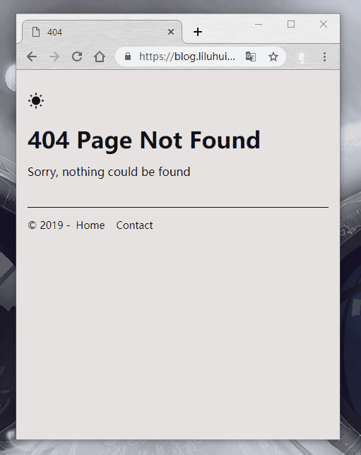

# :rainbow: 404 Page

No framework, so so easy 404 Page, to take away it to use.



## How do I use it

copy all files in folder `code` to your server, nothing else, no dependency.

## Config It !

### theme

this 404 Page provide two theme `white` and `dark`, the default is `white`

if you want to set, plase modify `index.html`, set dom `body` 's class to `drak`

```html
<body class="dark">
```

nothing else, so easy !

### links

in this page's footer, you can set some links

modify `index.html` , find function `setLinks`, send params in the function

e.g.
```javascript
setLinks([
  {name: 'Home', url: 'http://www.liluhui.cn'},
  {name: 'Contact', url: 'http://www.liluhui.cn/contact', target: '_blank'}
])
```